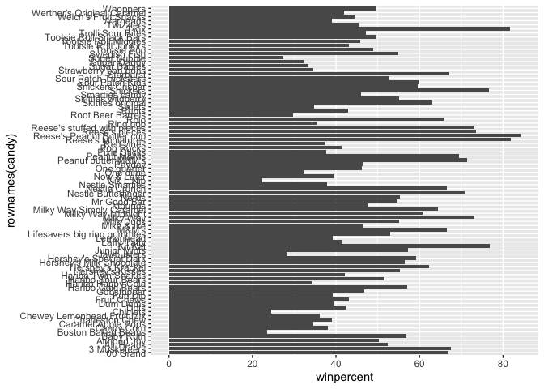
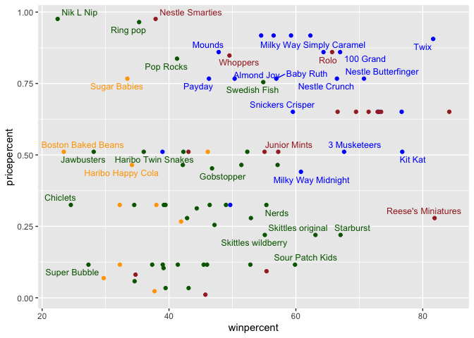

# Halloween Mini Project 103024
Janie Changberg (PID: A69037446)

``` r
candy_file <- "candy-data.csv"
candy = read.csv(candy_file,row.names=1)
head(candy)
```

                 chocolate fruity caramel peanutyalmondy nougat crispedricewafer
    100 Grand            1      0       1              0      0                1
    3 Musketeers         1      0       0              0      1                0
    One dime             0      0       0              0      0                0
    One quarter          0      0       0              0      0                0
    Air Heads            0      1       0              0      0                0
    Almond Joy           1      0       0              1      0                0
                 hard bar pluribus sugarpercent pricepercent winpercent
    100 Grand       0   1        0        0.732        0.860   66.97173
    3 Musketeers    0   1        0        0.604        0.511   67.60294
    One dime        0   0        0        0.011        0.116   32.26109
    One quarter     0   0        0        0.011        0.511   46.11650
    Air Heads       0   0        0        0.906        0.511   52.34146
    Almond Joy      0   1        0        0.465        0.767   50.34755

``` r
dim(candy)
```

    [1] 85 12

``` r
nrow(candy)
```

    [1] 85

``` r
sum(candy$fruity)
```

    [1] 38

\##Q1. How many different candy types are in this dataset?

> 85 different candies

\##Q2. How many fruity candy types are in the dataset?

> 38 types of fruity candy

``` r
candy["Twix", ]$winpercent
```

    [1] 81.64291

``` r
candy["Reese's Peanut Butter cup",]$winpercent
```

    [1] 84.18029

``` r
candy["Kit Kat",]$winpercent
```

    [1] 76.7686

``` r
candy["Tootsie Roll Snack Bars",]$winpercent
```

    [1] 49.6535

\##Q3. What is your favorite candy in the dataset and what is its
`winpercent` value?

> Reese’s Peanut Butter Cups, 84.18029.

\##Q4. What is the `winpercent` value for “Kit Kat”?

> 76.768

\##Q5. What is the `winpercent` value for “Tootsie Roll Snack Bars”?
\>49.6535

Installed Skimr:

``` r
library("skimr")
skim(candy)
```

|                                                  |       |
|:-------------------------------------------------|:------|
| Name                                             | candy |
| Number of rows                                   | 85    |
| Number of columns                                | 12    |
| \_\_\_\_\_\_\_\_\_\_\_\_\_\_\_\_\_\_\_\_\_\_\_   |       |
| Column type frequency:                           |       |
| numeric                                          | 12    |
| \_\_\_\_\_\_\_\_\_\_\_\_\_\_\_\_\_\_\_\_\_\_\_\_ |       |
| Group variables                                  | None  |

Data summary

**Variable type: numeric**

| skim_variable | n_missing | complete_rate | mean | sd | p0 | p25 | p50 | p75 | p100 | hist |
|:---|---:|---:|---:|---:|---:|---:|---:|---:|---:|:---|
| chocolate | 0 | 1 | 0.44 | 0.50 | 0.00 | 0.00 | 0.00 | 1.00 | 1.00 | ▇▁▁▁▆ |
| fruity | 0 | 1 | 0.45 | 0.50 | 0.00 | 0.00 | 0.00 | 1.00 | 1.00 | ▇▁▁▁▆ |
| caramel | 0 | 1 | 0.16 | 0.37 | 0.00 | 0.00 | 0.00 | 0.00 | 1.00 | ▇▁▁▁▂ |
| peanutyalmondy | 0 | 1 | 0.16 | 0.37 | 0.00 | 0.00 | 0.00 | 0.00 | 1.00 | ▇▁▁▁▂ |
| nougat | 0 | 1 | 0.08 | 0.28 | 0.00 | 0.00 | 0.00 | 0.00 | 1.00 | ▇▁▁▁▁ |
| crispedricewafer | 0 | 1 | 0.08 | 0.28 | 0.00 | 0.00 | 0.00 | 0.00 | 1.00 | ▇▁▁▁▁ |
| hard | 0 | 1 | 0.18 | 0.38 | 0.00 | 0.00 | 0.00 | 0.00 | 1.00 | ▇▁▁▁▂ |
| bar | 0 | 1 | 0.25 | 0.43 | 0.00 | 0.00 | 0.00 | 0.00 | 1.00 | ▇▁▁▁▂ |
| pluribus | 0 | 1 | 0.52 | 0.50 | 0.00 | 0.00 | 1.00 | 1.00 | 1.00 | ▇▁▁▁▇ |
| sugarpercent | 0 | 1 | 0.48 | 0.28 | 0.01 | 0.22 | 0.47 | 0.73 | 0.99 | ▇▇▇▇▆ |
| pricepercent | 0 | 1 | 0.47 | 0.29 | 0.01 | 0.26 | 0.47 | 0.65 | 0.98 | ▇▇▇▇▆ |
| winpercent | 0 | 1 | 50.32 | 14.71 | 22.45 | 39.14 | 47.83 | 59.86 | 84.18 | ▃▇▆▅▂ |

\##Q6. Is there any variable/column that looks to be on a different
scale to the majority of the other columns in the dataset?

> The three “percent” values (sugarpercent, pricepercent, winpercent)
> are continuous variables vs binary values (the other columns are 0
> or 1) for the p0-p100 values.

\##Q7. What do you think a zero and one represent for the
candy\$chocolate column?

> They likely represent a “yes/no” answer to whether that particular
> candy contains that element.

\##Q8. Plot a histogram of `winpercent` values

``` r
library(ggplot2)

ggplot(candy, aes(x=winpercent))+
  geom_histogram(binwidth=5, color=("black"))
```


\##Q9. Is the distribution of `winpercent` values symmetrical?

> No, the values are skewed to the right.

\##Q10. Is the center of the distribution above or below 50%?

> The center of the distribution is below 50%.

\##Q11. On average is chocolate candy higher or lower ranked than fruit
candy?

``` r
choc_mean <- mean(candy$winpercent[as.logical(candy$chocolate)], na.rm=TRUE)
fruit_mean <- mean(candy$winpercent[as.logical(candy$fruity)], na.rm=TRUE)

choc_mean
```

    [1] 60.92153

``` r
fruit_mean
```

    [1] 44.11974

> Chocolate candy is ranked higher than fruit candy (60.92% win vs
> 44.12% win)

\##Q12. Is this difference statistically significant?

``` r
ttest_chocvsfruit <- t.test(candy$winpercent[as.logical(candy$chocolate)], na.rm=TRUE,candy$winpercent[as.logical(candy$fruity)], na.rm=TRUE)

ttest_chocvsfruit
```


        Welch Two Sample t-test

    data:  candy$winpercent[as.logical(candy$chocolate)] and candy$winpercent[as.logical(candy$fruity)]
    t = 6.2582, df = 68.882, p-value = 2.871e-08
    alternative hypothesis: true difference in means is not equal to 0
    95 percent confidence interval:
     11.44563 22.15795
    sample estimates:
    mean of x mean of y 
     60.92153  44.11974 

> Yes, this difference is statistically significant, p-val=2.871e-08

\##Q13. what are the five least liked candy types in this set?

``` r
inds <- order(candy$winpercent)
head(candy[inds,])
```

                       chocolate fruity caramel peanutyalmondy nougat
    Nik L Nip                  0      1       0              0      0
    Boston Baked Beans         0      0       0              1      0
    Chiclets                   0      1       0              0      0
    Super Bubble               0      1       0              0      0
    Jawbusters                 0      1       0              0      0
    Root Beer Barrels          0      0       0              0      0
                       crispedricewafer hard bar pluribus sugarpercent pricepercent
    Nik L Nip                         0    0   0        1        0.197        0.976
    Boston Baked Beans                0    0   0        1        0.313        0.511
    Chiclets                          0    0   0        1        0.046        0.325
    Super Bubble                      0    0   0        0        0.162        0.116
    Jawbusters                        0    1   0        1        0.093        0.511
    Root Beer Barrels                 0    1   0        1        0.732        0.069
                       winpercent
    Nik L Nip            22.44534
    Boston Baked Beans   23.41782
    Chiclets             24.52499
    Super Bubble         27.30386
    Jawbusters           28.12744
    Root Beer Barrels    29.70369

> Nik L Nip, Boston Baked Beans, Chiclets, Super Bubble, Jawbusters

\##Q14. What are the top 5 all time favorite candy types out of this
set?

``` r
inds2 <- order(candy$winpercent)
tail(candy[inds,])
```

                              chocolate fruity caramel peanutyalmondy nougat
    Reese's pieces                    1      0       0              1      0
    Snickers                          1      0       1              1      1
    Kit Kat                           1      0       0              0      0
    Twix                              1      0       1              0      0
    Reese's Miniatures                1      0       0              1      0
    Reese's Peanut Butter cup         1      0       0              1      0
                              crispedricewafer hard bar pluribus sugarpercent
    Reese's pieces                           0    0   0        1        0.406
    Snickers                                 0    0   1        0        0.546
    Kit Kat                                  1    0   1        0        0.313
    Twix                                     1    0   1        0        0.546
    Reese's Miniatures                       0    0   0        0        0.034
    Reese's Peanut Butter cup                0    0   0        0        0.720
                              pricepercent winpercent
    Reese's pieces                   0.651   73.43499
    Snickers                         0.651   76.67378
    Kit Kat                          0.511   76.76860
    Twix                             0.906   81.64291
    Reese's Miniatures               0.279   81.86626
    Reese's Peanut Butter cup        0.651   84.18029

> Reese’s pieces, Snickers, Kit Kat, Twix, Reese’s Miniatures

\##Q15. Make a first barplot of candy ranking based on winpercent
values.

``` r
q15plot<- ggplot(candy)+
  aes(winpercent, rownames(candy))+
  geom_col()
q15plot
```



\##Q16. This is quite ugly, use the reorder() function to get the bars
sorted by winpercent?

``` r
q16plot <- ggplot(candy)+
  aes(winpercent, reorder(rownames(candy),winpercent))+
  geom_col()
q16plot
```


\##Let’s make it purdy

``` r
my_cols=rep("orange", nrow(candy))
my_cols[as.logical(candy$chocolate)] = "brown"
my_cols[as.logical(candy$bar)] = "blue"
my_cols[as.logical(candy$fruity)] = "darkgreen"

beautify <- ggplot(candy) + 
  aes(winpercent, reorder(rownames(candy),winpercent)) +
  geom_col(fill=my_cols) 
beautify
```


\##Q17. What is the worst ranked chocolate candy? \>The worst ranked
chocolate candy is sixlets (as an aside, I have never heard of these).

\##Q18. What is the best ranked fruity candy? \>The best ranked fruity
candy is starbursts.

\##What about value for money? What is the the best candy for the least
money?

``` r
library(ggrepel)


bestval <- ggplot(candy) +
  aes(winpercent, pricepercent, label=rownames(candy)) +
  geom_point(col=my_cols) + 
  geom_text_repel(col=my_cols, size=3.3, max.overlaps = 5)
bestval
```

    Warning: ggrepel: 50 unlabeled data points (too many overlaps). Consider
    increasing max.overlaps



\##Q19. Which candy type is the highest ranked in terms of winpercent
for the least money - i.e. offers the most bang for your buck?

> Reese’s Miniatures are around the 25th percentile in price, and is the
> second most popular candy.

\##Q20. What are the top 5 most expensive candy types in the dataset and
of these which is the least popular?

``` r
my_cols=rep("orange", nrow(candy))
my_cols[as.logical(candy$chocolate)] = "brown"
my_cols[as.logical(candy$bar)] = "blue"
my_cols[as.logical(candy$fruity)] = "darkgreen"

q20beautify <- ggplot(candy) + 
  aes(pricepercent, reorder(rownames(candy),pricepercent)) +
  geom_col(fill=my_cols) 
q20beautify
```


> Nik L Nip, Nestle Smarties, Ring Pop, Mr. Good bar, and Hershey’s
> Special Dark. The least popular of these is Nik L Nip.

\##Q21. Make a barplot again with geom_col() this time using
pricepercent and then improve this step by step, first ordering the
x-axis by value and finally making a so called “dot chat” or “lollipop”
chart by swapping geom_col() for geom_point() + geom_segment().

> see plot generated for Q20 for barplot based on pricepercent. Below is
> the called for improvement:

``` r
lollipoppriceplot <- ggplot(candy) +
  aes(pricepercent, reorder(rownames(candy), pricepercent)) +
  geom_segment(aes(yend = reorder(rownames(candy), pricepercent), xend = 0), col="gray40") +
  geom_point()
lollipoppriceplot
```


\##Exploring the Correlation Structure

``` r
library(corrplot)
```

    corrplot 0.95 loaded

``` r
corstruct <- cor(candy)
corrplot(corstruct)
```


\##Q22. Examining this plot what two variables are anti-correlated
(i.e. have minus values)?

> Chocolate and Fruity, bar and pluribus.

\##Q23. Similarly, what two variables are most positively correlated?

> Chocolate & bar, and Chocolate & winpercent

\##Principal Component Analysis

``` r
pca <- prcomp(candy, scale=TRUE)
summary(pca)
```

    Importance of components:
                              PC1    PC2    PC3     PC4    PC5     PC6     PC7
    Standard deviation     2.0788 1.1378 1.1092 1.07533 0.9518 0.81923 0.81530
    Proportion of Variance 0.3601 0.1079 0.1025 0.09636 0.0755 0.05593 0.05539
    Cumulative Proportion  0.3601 0.4680 0.5705 0.66688 0.7424 0.79830 0.85369
                               PC8     PC9    PC10    PC11    PC12
    Standard deviation     0.74530 0.67824 0.62349 0.43974 0.39760
    Proportion of Variance 0.04629 0.03833 0.03239 0.01611 0.01317
    Cumulative Proportion  0.89998 0.93832 0.97071 0.98683 1.00000

``` r
plot(pca$x[,1:2], col=my_cols, pch=18)
```


``` r
# Make a new data-frame with our PCA results and candy data
my_data <- cbind(candy, pca$x[,1:3])
```

\##Make nice with GGPlot:

``` r
p <- ggplot(my_data) + 
        aes(x=PC1, y=PC2, 
            size=winpercent/100,  
            text=rownames(my_data),
            label=rownames(my_data)) +
        geom_point(col=my_cols)

p
```


\##Use GGRepel to make labels that don’t overlap

``` r
library(ggrepel)

p + geom_text_repel(size=3.3, col=my_cols, max.overlaps = 7)  + 
  theme(legend.position = "none") +
  labs(title="Halloween Candy PCA Space",
       subtitle="Colored by type: chocolate bar (dark brown), chocolate other (light brown), fruity (red), other (black)",
       caption="Data from 538")
```

    Warning: ggrepel: 39 unlabeled data points (too many overlaps). Consider
    increasing max.overlaps


\##Still weird, use plotly

``` r
library(plotly)
```


    Attaching package: 'plotly'

    The following object is masked from 'package:ggplot2':

        last_plot

    The following object is masked from 'package:stats':

        filter

    The following object is masked from 'package:graphics':

        layout

``` r
ggplotly(p)
```


``` r
par(mar=c(8,4,2,2))
barplot(pca$rotation[,1], las=2, ylab="PC1 Contribution")
```


\##Q24. What original variables are picked up strongly by PC1 in the
positive direction? Do these make sense to you?

> Fruity and Pluribus. Yes, fruity candy often is sold as multiples in a
> packet.
