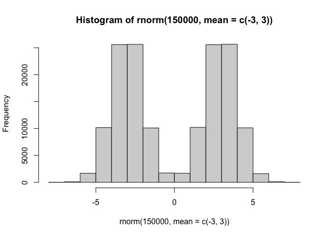
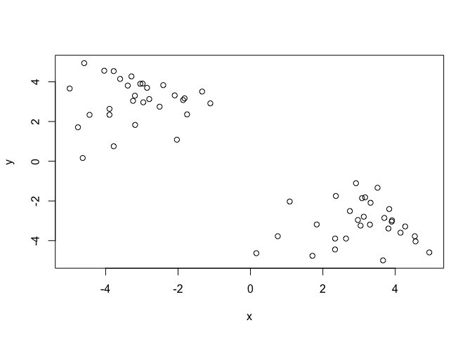
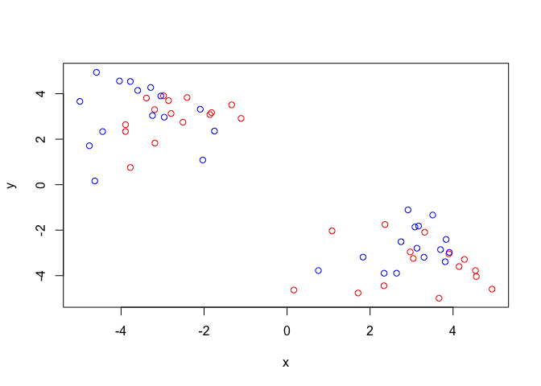
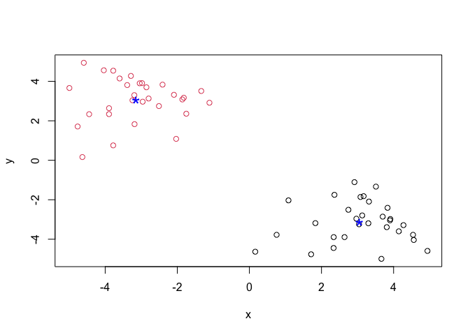
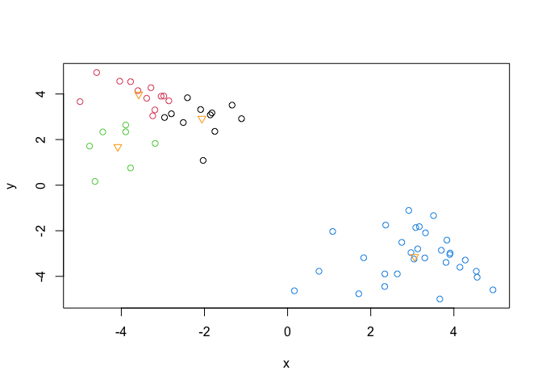
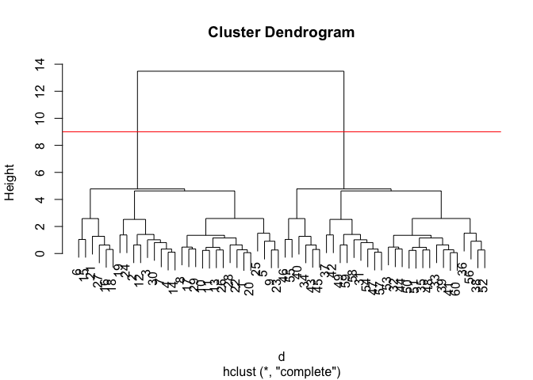
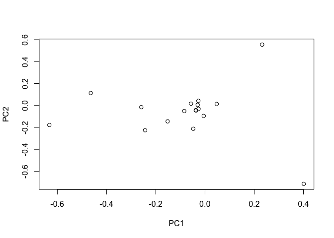

# JCW_102324_Bioinfo_Class7MachineLearning1
Janie Chang-Weinberg (A69037446)

Before we get into clustering methods, let’s make some sample data to
cluster where we know what the answer should be.

To help with this, let’s use the `rnorm()` function.

``` r
hist(rnorm(150000, mean=c(-3,3)))
```



``` r
x <- c(rnorm(30,mean=+3),rnorm(30,mean=-3))
y <- rev(x)

z <- cbind(x,y)
z
```

                   x          y
     [1,]  3.9004299 -3.0432744
     [2,]  2.9146694 -1.1084407
     [3,]  2.3593287 -1.7505462
     [4,]  3.0815130 -1.8602189
     [5,]  4.9399931 -4.5931090
     [6,]  0.7549375 -3.7772148
     [7,]  3.3171137 -2.0922529
     [8,]  3.8107044 -3.3893689
     [9,]  4.5393692 -3.7770427
    [10,]  3.1297751 -2.7954648
    [11,]  2.9676258 -2.9604000
    [12,]  3.5100548 -1.3354106
    [13,]  3.0415712 -3.2435208
    [14,]  3.1690912 -1.8197876
    [15,]  0.1626718 -4.6331149
    [16,]  2.6389757 -3.8932944
    [17,]  4.1452227 -3.6001719
    [18,]  2.3385657 -3.8945426
    [19,]  1.0841938 -2.0313957
    [20,]  3.9096074 -2.9780459
    [21,]  1.7120296 -4.7642873
    [22,]  3.6983344 -2.8564970
    [23,]  4.5599810 -4.0382864
    [24,]  1.8308364 -3.1857423
    [25,]  3.6623172 -4.9935319
    [26,]  3.3001695 -3.1922569
    [27,]  2.3358537 -4.4449212
    [28,]  3.8326364 -2.4090736
    [29,]  4.2735892 -3.2866967
    [30,]  2.7466865 -2.5095122
    [31,] -2.5095122  2.7466865
    [32,] -3.2866967  4.2735892
    [33,] -2.4090736  3.8326364
    [34,] -4.4449212  2.3358537
    [35,] -3.1922569  3.3001695
    [36,] -4.9935319  3.6623172
    [37,] -3.1857423  1.8308364
    [38,] -4.0382864  4.5599810
    [39,] -2.8564970  3.6983344
    [40,] -4.7642873  1.7120296
    [41,] -2.9780459  3.9096074
    [42,] -2.0313957  1.0841938
    [43,] -3.8945426  2.3385657
    [44,] -3.6001719  4.1452227
    [45,] -3.8932944  2.6389757
    [46,] -4.6331149  0.1626718
    [47,] -1.8197876  3.1690912
    [48,] -3.2435208  3.0415712
    [49,] -1.3354106  3.5100548
    [50,] -2.9604000  2.9676258
    [51,] -2.7954648  3.1297751
    [52,] -3.7770427  4.5393692
    [53,] -3.3893689  3.8107044
    [54,] -2.0922529  3.3171137
    [55,] -3.7772148  0.7549375
    [56,] -4.5931090  4.9399931
    [57,] -1.8602189  3.0815130
    [58,] -1.7505462  2.3593287
    [59,] -1.1084407  2.9146694
    [60,] -3.0432744  3.9004299

``` r
plot(z)
```



## K-means clustering

The function in base R for clustering is `kmeans()`

``` r
km <- kmeans(z,2)
km
```

    K-means clustering with 2 clusters of sizes 30, 30

    Cluster means:
              x         y
    1  3.055595 -3.141914
    2 -3.141914  3.055595

    Clustering vector:
     [1] 1 1 1 1 1 1 1 1 1 1 1 1 1 1 1 1 1 1 1 1 1 1 1 1 1 1 1 1 1 1 2 2 2 2 2 2 2 2
    [39] 2 2 2 2 2 2 2 2 2 2 2 2 2 2 2 2 2 2 2 2 2 2

    Within cluster sum of squares by cluster:
    [1] 68.51071 68.51071
     (between_SS / total_SS =  89.4 %)

    Available components:

    [1] "cluster"      "centers"      "totss"        "withinss"     "tot.withinss"
    [6] "betweenss"    "size"         "iter"         "ifault"      

> Q. Print out the cluster membership vector (ie, our main answer)

``` r
km$cluster
```

     [1] 1 1 1 1 1 1 1 1 1 1 1 1 1 1 1 1 1 1 1 1 1 1 1 1 1 1 1 1 1 1 2 2 2 2 2 2 2 2
    [39] 2 2 2 2 2 2 2 2 2 2 2 2 2 2 2 2 2 2 2 2 2 2

``` r
plot(z, col=c("red","blue"))
```



To plot with color by cluster result and add cluster centers:

``` r
plot(z, col=km$cluster)
points(km$centers, col="blue", pch=42,cex=2)
```



> Q. Can you cluster our data in `z` into four clusters?

``` r
km4 <- kmeans(z,centers=4)
plot(z, col=km4$cluster)
points(km4$centers, col="orange",pch=25)
```



## Hierarchical Clustering

The main function for hierarchical clustering in base R is called
`hclust()`

Unlike `kmeans()`, you cannot just pass in the data as input. You first
need a distance matrix from the data.

``` r
d <- dist(z)
hc <- hclust(d)
hc
```


    Call:
    hclust(d = d)

    Cluster method   : complete 
    Distance         : euclidean 
    Number of objects: 60 

There is a specific hclust plot() method…

``` r
plot(hc)
abline(h=9, col="red")
```



To get the main clustering result (ie, the membership vector), you can
“cut” the cluster dendrogram at a given height. To perform this, use
`cutree()`

``` r
grps <- cutree(hc, h=9)
grps
```

     [1] 1 1 1 1 1 1 1 1 1 1 1 1 1 1 1 1 1 1 1 1 1 1 1 1 1 1 1 1 1 1 2 2 2 2 2 2 2 2
    [39] 2 2 2 2 2 2 2 2 2 2 2 2 2 2 2 2 2 2 2 2 2 2

## Principal Component Analysis

“Principal component analysis (PCA) is a well established”multivariate
statistical technique” used to reduce the dimensionality of a complex
data set to a more manageable number (typically 2D or 3D). This method
is particularly useful for highlighting strong paterns and relationships
in large datasets (i.e. revealing major similarities and diferences)
that are otherwise hard to visualize. As we will see again and again in
this course PCA is often used to make all sorts of bioinformatics data
easy to explore and visualize.” -ripped from webpage

``` r
url <- "https://tinyurl.com/UK-foods"
x <- read.csv(url)
dim(x)
```

    [1] 17  5

``` r
x
```

                         X England Wales Scotland N.Ireland
    1               Cheese     105   103      103        66
    2        Carcass_meat      245   227      242       267
    3          Other_meat      685   803      750       586
    4                 Fish     147   160      122        93
    5       Fats_and_oils      193   235      184       209
    6               Sugars     156   175      147       139
    7      Fresh_potatoes      720   874      566      1033
    8           Fresh_Veg      253   265      171       143
    9           Other_Veg      488   570      418       355
    10 Processed_potatoes      198   203      220       187
    11      Processed_Veg      360   365      337       334
    12        Fresh_fruit     1102  1137      957       674
    13            Cereals     1472  1582     1462      1494
    14           Beverages      57    73       53        47
    15        Soft_drinks     1374  1256     1572      1506
    16   Alcoholic_drinks      375   475      458       135
    17      Confectionery       54    64       62        41

``` r
rownames(x) <- x[,1]
x <- x[,-1]
head(x)
```

                   England Wales Scotland N.Ireland
    Cheese             105   103      103        66
    Carcass_meat       245   227      242       267
    Other_meat         685   803      750       586
    Fish               147   160      122        93
    Fats_and_oils      193   235      184       209
    Sugars             156   175      147       139

> Plot 1 (rainbow bar plot)

``` r
barplot(as.matrix(x), beside=T, col=rainbow(nrow(x)))
```


> Q. 3 (pls do this for a barplot)

``` r
pairs(x, col=rainbow(10), pch=16)
```


## Principal Component Analysis can help organize data

The main function to do PCA in base R is `prcomp()` The way the data are
organized currently will not work, you must first transpose the data

``` r
pca <- prcomp(t(x))
summary(pca)
```

    Importance of components:
                                PC1      PC2      PC3       PC4
    Standard deviation     324.1502 212.7478 73.87622 2.921e-14
    Proportion of Variance   0.6744   0.2905  0.03503 0.000e+00
    Cumulative Proportion    0.6744   0.9650  1.00000 1.000e+00

Check what is inside `pca` that has been calculated

``` r
attributes(pca)
```

    $names
    [1] "sdev"     "rotation" "center"   "scale"    "x"       

    $class
    [1] "prcomp"

``` r
pca$x
```

                     PC1         PC2        PC3           PC4
    England   -144.99315   -2.532999 105.768945 -9.152022e-15
    Wales     -240.52915 -224.646925 -56.475555  5.560040e-13
    Scotland   -91.86934  286.081786 -44.415495 -6.638419e-13
    N.Ireland  477.39164  -58.901862  -4.877895  1.329771e-13

To make our main results figure called a “PC plot” (or
score/ordination/PC1vsPC2 plot)

``` r
plot(pca$x[,1], pca$x[,2], 
     col=c("black", "red", "blue", "darkgreen"),
     pch=16,
     xlab="PC1 (67.4%)", ylab="PC2 (29%)")
```


# variable loadings plot

can give us insight as to how the original variables (in this case the
the foods) contribute to our PC axis

``` r
pca$rotation
```

                                 PC1          PC2         PC3          PC4
    Cheese              -0.056955380  0.016012850  0.02394295 -0.409382587
    Carcass_meat         0.047927628  0.013915823  0.06367111  0.729481922
    Other_meat          -0.258916658 -0.015331138 -0.55384854  0.331001134
    Fish                -0.084414983 -0.050754947  0.03906481  0.022375878
    Fats_and_oils       -0.005193623 -0.095388656 -0.12522257  0.034512161
    Sugars              -0.037620983 -0.043021699 -0.03605745  0.024943337
    Fresh_potatoes       0.401402060 -0.715017078 -0.20668248  0.021396007
    Fresh_Veg           -0.151849942 -0.144900268  0.21382237  0.001606882
    Other_Veg           -0.243593729 -0.225450923 -0.05332841  0.031153231
    Processed_potatoes  -0.026886233  0.042850761 -0.07364902 -0.017379680
    Processed_Veg       -0.036488269 -0.045451802  0.05289191  0.021250980
    Fresh_fruit         -0.632640898 -0.177740743  0.40012865  0.227657348
    Cereals             -0.047702858 -0.212599678 -0.35884921  0.100043319
    Beverages           -0.026187756 -0.030560542 -0.04135860 -0.018382072
    Soft_drinks          0.232244140  0.555124311 -0.16942648  0.222319484
    Alcoholic_drinks    -0.463968168  0.113536523 -0.49858320 -0.273126013
    Confectionery       -0.029650201  0.005949921 -0.05232164  0.001890737

``` r
plot(pca$rotation)
```


