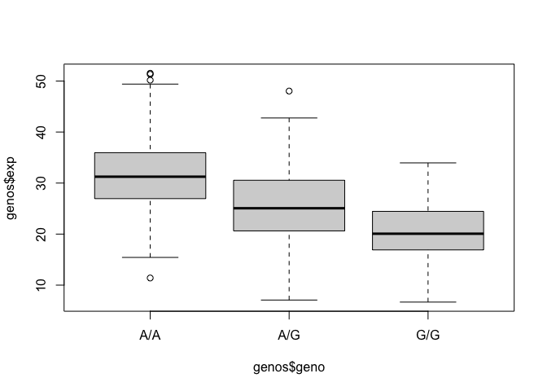

# JCW_110824_GenomeInformatics_Class12
Janie Chang-Weinberg (A69037446)

Looking through MXL .csv

``` r
mxl <- read.csv("373531-SampleGenotypes-Homo_sapiens_Variation_Sample_rs8067378.csv")
```

``` r
tbl.mxl <- table(mxl$Genotype..forward.strand.)
tbl.mxl
```


    A|A A|G G|A G|G 
     22  21  12   9 

> There are 9 instances of G\|G out of 64 genotypes. 14.06% are
> homozygous for the asthma-related SNP.

## Homework (Questions 13 and 14)

Q13: Read this file into R and determine the sample size for each
genotype and their corresponding median expression levels for each of
these genotypes.

Read txt file into .csv

``` r
genos <- read.table("https://bioboot.github.io/bggn213_F24/class-material/rs8067378_ENSG00000172057.6.txt")

head(genos)
```

       sample geno      exp
    1 HG00367  A/G 28.96038
    2 NA20768  A/G 20.24449
    3 HG00361  A/A 31.32628
    4 HG00135  A/A 34.11169
    5 NA18870  G/G 18.25141
    6 NA11993  A/A 32.89721

``` r
summary(genos)
```

        sample              geno                exp        
     Length:462         Length:462         Min.   : 6.675  
     Class :character   Class :character   1st Qu.:20.004  
     Mode  :character   Mode  :character   Median :25.116  
                                           Mean   :25.640  
                                           3rd Qu.:30.779  
                                           Max.   :51.518  

``` r
genosplot <- boxplot(genos$exp ~ genos$geno)
```



``` r
genosplot
```

    $stats
             [,1]     [,2]     [,3]
    [1,] 15.42908  7.07505  6.67482
    [2,] 26.95022 20.62572 16.90256
    [3,] 31.24847 25.06486 20.07363
    [4,] 35.95503 30.55183 24.45672
    [5,] 49.39612 42.75662 33.95602

    $n
    [1] 108 233 121

    $conf
             [,1]     [,2]     [,3]
    [1,] 29.87942 24.03742 18.98858
    [2,] 32.61753 26.09230 21.15868

    $out
    [1] 51.51787 50.16704 51.30170 11.39643 48.03410

    $group
    [1] 1 1 1 1 2

    $names
    [1] "A/A" "A/G" "G/G"

> Sample sizes: A/A: 108 A/G: 233 G/G: 121

> Median expression levels: A/A: 31.24847 A/G: 25.06486 G/G: 20.07363

Q14: Generate a boxplot with a box per genotype, what could you infer
from the relative expression value between A/A and G/G displayed in this
plot? Does the SNP effect the expression of ORMDL3?

> (see above for boxplot, I should have read ahead, oops) The overall
> expression levels of A/A is greater than G/G, indicating that the SNP
> negatively impacts expression of G/G vs A/A
