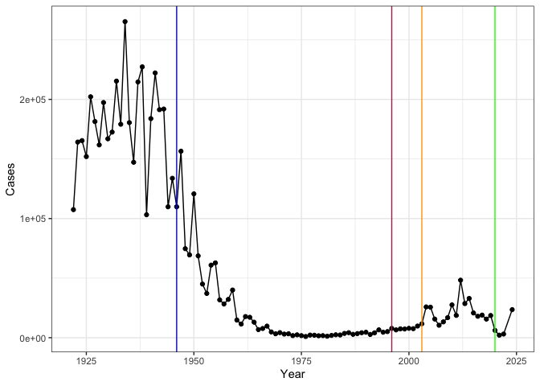
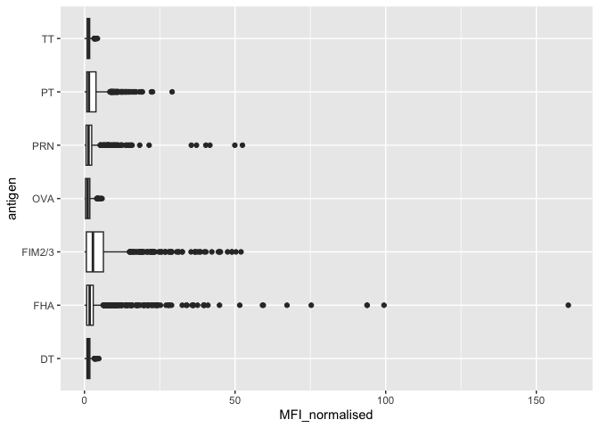
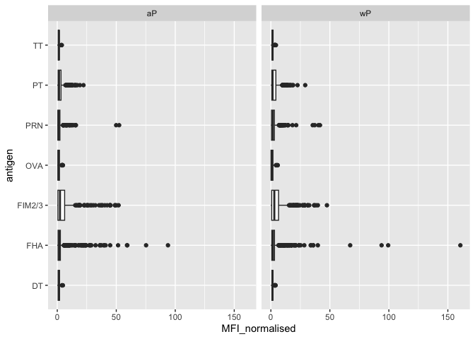
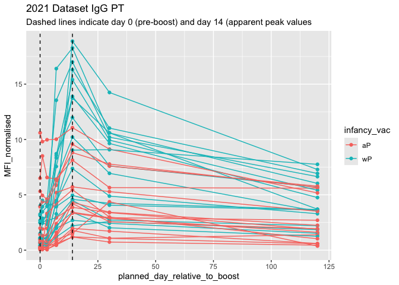

# Investigating Pertussis Resurgence, Class 15
Janie Chang-Weinberg (A69037446)

Pertussis, aka “whooping cough” is a highly contagious lung infection
caused by the *B. Pertussis* bacteria.

The CDC tracks Pertussis case numbers and they can be accessed
[here](https://www.cdc.gov/pertussis/php/surveillance/pertussis-cases-by-year.html?CDC_AAref_Val=https://www.cdc.gov/pertussis/surv-reporting/cases-by-year.html)

We need to “scrape” this data so we do stuff with it in R. Let’s try the
**datapasta** package to do this.

``` r
cdc <- data.frame(
                                 Year = c(1922L,1923L,1924L,1925L,
                                          1926L,1927L,1928L,1929L,1930L,1931L,
                                          1932L,1933L,1934L,1935L,1936L,
                                          1937L,1938L,1939L,1940L,1941L,1942L,
                                          1943L,1944L,1945L,1946L,1947L,
                                          1948L,1949L,1950L,1951L,1952L,
                                          1953L,1954L,1955L,1956L,1957L,1958L,
                                          1959L,1960L,1961L,1962L,1963L,
                                          1964L,1965L,1966L,1967L,1968L,1969L,
                                          1970L,1971L,1972L,1973L,1974L,
                                          1975L,1976L,1977L,1978L,1979L,1980L,
                                          1981L,1982L,1983L,1984L,1985L,
                                          1986L,1987L,1988L,1989L,1990L,
                                          1991L,1992L,1993L,1994L,1995L,1996L,
                                          1997L,1998L,1999L,2000L,2001L,
                                          2002L,2003L,2004L,2005L,2006L,2007L,
                                          2008L,2009L,2010L,2011L,2012L,
                                          2013L,2014L,2015L,2016L,2017L,2018L,
                                          2019L,2020L,2021L,2022L,2024L),
         Cases = c(107473,164191,165418,152003,
                                          202210,181411,161799,197371,
                                          166914,172559,215343,179135,265269,
                                          180518,147237,214652,227319,103188,
                                          183866,222202,191383,191890,109873,
                                          133792,109860,156517,74715,69479,
                                          120718,68687,45030,37129,60886,
                                          62786,31732,28295,32148,40005,
                                          14809,11468,17749,17135,13005,6799,
                                          7717,9718,4810,3285,4249,3036,
                                          3287,1759,2402,1738,1010,2177,2063,
                                          1623,1730,1248,1895,2463,2276,
                                          3589,4195,2823,3450,4157,4570,
                                          2719,4083,6586,4617,5137,7796,6564,
                                          7405,7298,7867,7580,9771,11647,
                                          25827,25616,15632,10454,13278,
                                          16858,27550,18719,48277,28639,32971,
                                          20762,17972,18975,15609,18617,
                                          6124,2116,3044, 23544)
       )
```

``` r
library(ggplot2)

baseplot <- ggplot(cdc, aes(Year, Cases)) +
  geom_point() + 
  geom_line()

baseplot
```


Let’s add the date of the wP vaccination introduction.

``` r
baseplot +
  theme_bw() +
  geom_vline(xintercept = 1946, color = "blue")
```


Let’s add the date of the switch to the new aP vaccine.

``` r
baseplot +
  theme_bw() +
  geom_vline(xintercept = 1946, color = "blue") +
  geom_vline(xintercept = 1996, color = "maroon")
```


let’s add in COVID

``` r
baseplot +
  theme_bw() +
  geom_vline(xintercept = 1946, color = "blue") +
  geom_vline(xintercept = 1996, color = "maroon") +
  geom_vline(xintercept = 2020, color = "green")
```


There was a pertussis outbreak in Disneyland or something

``` r
baseplot +
  theme_bw() +
  geom_vline(xintercept = 1946, color = "blue") +
  geom_vline(xintercept = 1996, color = "maroon") +
  geom_vline(xintercept = 2020, color = "green") +
  geom_vline(xintercept = 2003, color = "orange")
```



## CMI-PB (Computational Models of Immunity - Pertussis Boost)

This project collects and makes freely available data about the immune
response to Pertussis vaccination.

You can access the data via an API which returns JSON format (key:value
pairs).

We can use the **jsonlite** package and it’s `read_json()` function.

``` r
library(jsonlite)

subject <- read_json("http://cmi-pb.org/api/v5/subject",
                     simplifyVector = TRUE)

# let's take a gander
head(subject)
```

      subject_id infancy_vac biological_sex              ethnicity  race
    1          1          wP         Female Not Hispanic or Latino White
    2          2          wP         Female Not Hispanic or Latino White
    3          3          wP         Female                Unknown White
    4          4          wP           Male Not Hispanic or Latino Asian
    5          5          wP           Male Not Hispanic or Latino Asian
    6          6          wP         Female Not Hispanic or Latino White
      year_of_birth date_of_boost      dataset
    1    1986-01-01    2016-09-12 2020_dataset
    2    1968-01-01    2019-01-28 2020_dataset
    3    1983-01-01    2016-10-10 2020_dataset
    4    1988-01-01    2016-08-29 2020_dataset
    5    1991-01-01    2016-08-29 2020_dataset
    6    1988-01-01    2016-10-10 2020_dataset

### How many subjects do we have?

``` r
nrow(subject)
```

    [1] 172

> there are 172 subjects here.

### How many male/female do we have?

``` r
table(subject$biological_sex)
```


    Female   Male 
       112     60 

> There are 112 females and 60 males

### How many wP and aP do we have?

``` r
table(subject$infancy_vac)
```


    aP wP 
    87 85 

> There are 85 wP and 87 aP.

### Breakdown of biological sex and race?

``` r
table(subject$race, subject$biological_sex)
```

                                               
                                                Female Male
      American Indian/Alaska Native                  0    1
      Asian                                         32   12
      Black or African American                      2    3
      More Than One Race                            15    4
      Native Hawaiian or Other Pacific Islander      1    1
      Unknown or Not Reported                       14    7
      White                                         48   32

### Does this breakdown reflect the US population?

``` r
table(subject$dataset)
```


    2020_dataset 2021_dataset 2022_dataset 2023_dataset 
              60           36           22           54 

> NO!

These data are still useful, however.

``` r
specimen <- read_json("http://cmi-pb.org/api/v5/specimen", 
                      simplifyVector = TRUE)

ab_titer <- read_json("http://cmi-pb.org/api/v5/plasma_ab_titer",
                      simplifyVector = TRUE)
```

``` r
head(specimen)
```

      specimen_id subject_id actual_day_relative_to_boost
    1           1          1                           -3
    2           2          1                            1
    3           3          1                            3
    4           4          1                            7
    5           5          1                           11
    6           6          1                           32
      planned_day_relative_to_boost specimen_type visit
    1                             0         Blood     1
    2                             1         Blood     2
    3                             3         Blood     3
    4                             7         Blood     4
    5                            14         Blood     5
    6                            30         Blood     6

``` r
head(ab_titer)
```

      specimen_id isotype is_antigen_specific antigen        MFI MFI_normalised
    1           1     IgE               FALSE   Total 1110.21154       2.493425
    2           1     IgE               FALSE   Total 2708.91616       2.493425
    3           1     IgG                TRUE      PT   68.56614       3.736992
    4           1     IgG                TRUE     PRN  332.12718       2.602350
    5           1     IgG                TRUE     FHA 1887.12263      34.050956
    6           1     IgE                TRUE     ACT    0.10000       1.000000
       unit lower_limit_of_detection
    1 UG/ML                 2.096133
    2 IU/ML                29.170000
    3 IU/ML                 0.530000
    4 IU/ML                 6.205949
    5 IU/ML                 4.679535
    6 IU/ML                 2.816431

We want to join `subject` and `specimen` together! Using dplyer, there
are two modes of joining– innerjoining or full joining. Inerjoining only
merges data frame values for which there are no values missing from
either dataset.

For this, we only want those who both were vaccinated and also had their
titers recorded, so we will use innerjoining.

``` r
library(dplyr)
```


    Attaching package: 'dplyr'

    The following objects are masked from 'package:stats':

        filter, lag

    The following objects are masked from 'package:base':

        intersect, setdiff, setequal, union

``` r
meta <- inner_join(subject, specimen)
```

    Joining with `by = join_by(subject_id)`

``` r
head(meta)
```

      subject_id infancy_vac biological_sex              ethnicity  race
    1          1          wP         Female Not Hispanic or Latino White
    2          1          wP         Female Not Hispanic or Latino White
    3          1          wP         Female Not Hispanic or Latino White
    4          1          wP         Female Not Hispanic or Latino White
    5          1          wP         Female Not Hispanic or Latino White
    6          1          wP         Female Not Hispanic or Latino White
      year_of_birth date_of_boost      dataset specimen_id
    1    1986-01-01    2016-09-12 2020_dataset           1
    2    1986-01-01    2016-09-12 2020_dataset           2
    3    1986-01-01    2016-09-12 2020_dataset           3
    4    1986-01-01    2016-09-12 2020_dataset           4
    5    1986-01-01    2016-09-12 2020_dataset           5
    6    1986-01-01    2016-09-12 2020_dataset           6
      actual_day_relative_to_boost planned_day_relative_to_boost specimen_type
    1                           -3                             0         Blood
    2                            1                             1         Blood
    3                            3                             3         Blood
    4                            7                             7         Blood
    5                           11                            14         Blood
    6                           32                            30         Blood
      visit
    1     1
    2     2
    3     3
    4     4
    5     5
    6     6

``` r
abdata <- inner_join(ab_titer, meta)
```

    Joining with `by = join_by(specimen_id)`

``` r
head(abdata)
```

      specimen_id isotype is_antigen_specific antigen        MFI MFI_normalised
    1           1     IgE               FALSE   Total 1110.21154       2.493425
    2           1     IgE               FALSE   Total 2708.91616       2.493425
    3           1     IgG                TRUE      PT   68.56614       3.736992
    4           1     IgG                TRUE     PRN  332.12718       2.602350
    5           1     IgG                TRUE     FHA 1887.12263      34.050956
    6           1     IgE                TRUE     ACT    0.10000       1.000000
       unit lower_limit_of_detection subject_id infancy_vac biological_sex
    1 UG/ML                 2.096133          1          wP         Female
    2 IU/ML                29.170000          1          wP         Female
    3 IU/ML                 0.530000          1          wP         Female
    4 IU/ML                 6.205949          1          wP         Female
    5 IU/ML                 4.679535          1          wP         Female
    6 IU/ML                 2.816431          1          wP         Female
                   ethnicity  race year_of_birth date_of_boost      dataset
    1 Not Hispanic or Latino White    1986-01-01    2016-09-12 2020_dataset
    2 Not Hispanic or Latino White    1986-01-01    2016-09-12 2020_dataset
    3 Not Hispanic or Latino White    1986-01-01    2016-09-12 2020_dataset
    4 Not Hispanic or Latino White    1986-01-01    2016-09-12 2020_dataset
    5 Not Hispanic or Latino White    1986-01-01    2016-09-12 2020_dataset
    6 Not Hispanic or Latino White    1986-01-01    2016-09-12 2020_dataset
      actual_day_relative_to_boost planned_day_relative_to_boost specimen_type
    1                           -3                             0         Blood
    2                           -3                             0         Blood
    3                           -3                             0         Blood
    4                           -3                             0         Blood
    5                           -3                             0         Blood
    6                           -3                             0         Blood
      visit
    1     1
    2     1
    3     1
    4     1
    5     1
    6     1

``` r
nrow(abdata)
```

    [1] 52576

wow !

``` r
head(abdata)
```

      specimen_id isotype is_antigen_specific antigen        MFI MFI_normalised
    1           1     IgE               FALSE   Total 1110.21154       2.493425
    2           1     IgE               FALSE   Total 2708.91616       2.493425
    3           1     IgG                TRUE      PT   68.56614       3.736992
    4           1     IgG                TRUE     PRN  332.12718       2.602350
    5           1     IgG                TRUE     FHA 1887.12263      34.050956
    6           1     IgE                TRUE     ACT    0.10000       1.000000
       unit lower_limit_of_detection subject_id infancy_vac biological_sex
    1 UG/ML                 2.096133          1          wP         Female
    2 IU/ML                29.170000          1          wP         Female
    3 IU/ML                 0.530000          1          wP         Female
    4 IU/ML                 6.205949          1          wP         Female
    5 IU/ML                 4.679535          1          wP         Female
    6 IU/ML                 2.816431          1          wP         Female
                   ethnicity  race year_of_birth date_of_boost      dataset
    1 Not Hispanic or Latino White    1986-01-01    2016-09-12 2020_dataset
    2 Not Hispanic or Latino White    1986-01-01    2016-09-12 2020_dataset
    3 Not Hispanic or Latino White    1986-01-01    2016-09-12 2020_dataset
    4 Not Hispanic or Latino White    1986-01-01    2016-09-12 2020_dataset
    5 Not Hispanic or Latino White    1986-01-01    2016-09-12 2020_dataset
    6 Not Hispanic or Latino White    1986-01-01    2016-09-12 2020_dataset
      actual_day_relative_to_boost planned_day_relative_to_boost specimen_type
    1                           -3                             0         Blood
    2                           -3                             0         Blood
    3                           -3                             0         Blood
    4                           -3                             0         Blood
    5                           -3                             0         Blood
    6                           -3                             0         Blood
      visit
    1     1
    2     1
    3     1
    4     1
    5     1
    6     1

``` r
table(abdata$isotype)
```


      IgE   IgG  IgG1  IgG2  IgG3  IgG4 
     6698  5389 10117 10124 10124 10124 

``` r
table(abdata$antigen)
```


        ACT   BETV1      DT   FELD1     FHA  FIM2/3   LOLP1     LOS Measles     OVA 
       1970    1970    4978    1970    5372    4978    1970    1970    1970    4978 
        PD1     PRN      PT     PTM   Total      TT 
       1970    5372    5372    1970     788    4978 

Let’s look at IgG.

``` r
igg <- filter(abdata, isotype=="IgG")
head(igg)
```

      specimen_id isotype is_antigen_specific antigen        MFI MFI_normalised
    1           1     IgG                TRUE      PT   68.56614       3.736992
    2           1     IgG                TRUE     PRN  332.12718       2.602350
    3           1     IgG                TRUE     FHA 1887.12263      34.050956
    4          19     IgG                TRUE      PT   20.11607       1.096366
    5          19     IgG                TRUE     PRN  976.67419       7.652635
    6          19     IgG                TRUE     FHA   60.76626       1.096457
       unit lower_limit_of_detection subject_id infancy_vac biological_sex
    1 IU/ML                 0.530000          1          wP         Female
    2 IU/ML                 6.205949          1          wP         Female
    3 IU/ML                 4.679535          1          wP         Female
    4 IU/ML                 0.530000          3          wP         Female
    5 IU/ML                 6.205949          3          wP         Female
    6 IU/ML                 4.679535          3          wP         Female
                   ethnicity  race year_of_birth date_of_boost      dataset
    1 Not Hispanic or Latino White    1986-01-01    2016-09-12 2020_dataset
    2 Not Hispanic or Latino White    1986-01-01    2016-09-12 2020_dataset
    3 Not Hispanic or Latino White    1986-01-01    2016-09-12 2020_dataset
    4                Unknown White    1983-01-01    2016-10-10 2020_dataset
    5                Unknown White    1983-01-01    2016-10-10 2020_dataset
    6                Unknown White    1983-01-01    2016-10-10 2020_dataset
      actual_day_relative_to_boost planned_day_relative_to_boost specimen_type
    1                           -3                             0         Blood
    2                           -3                             0         Blood
    3                           -3                             0         Blood
    4                           -3                             0         Blood
    5                           -3                             0         Blood
    6                           -3                             0         Blood
      visit
    1     1
    2     1
    3     1
    4     1
    5     1
    6     1

Make a boxplot of IgG antigen levels. This will be a plot of MFI vs
antigen.

``` r
ggplot(igg, aes(MFI_normalised, antigen)) +
  geom_boxplot()
```



``` r
ggplot(igg, aes(MFI_normalised, antigen, color = infancy_vac)) +
  geom_boxplot()
```


Ideally, we would like to see how these Ab levels change over time
relative to the booster shot.

``` r
table(abdata$visit)
```


       1    2    3    4    5    6    7    8    9   10   11   12 
    8280 8280 8420 6565 6565 6210 5810  815  735  686  105  105 

``` r
ggplot(igg)+
  aes(MFI_normalised, antigen) +
  geom_boxplot() +
  facet_wrap(~infancy_vac)
```



``` r
ggplot(igg)+
  aes(MFI_normalised, antigen, color = infancy_vac) +
  geom_boxplot() +
  facet_wrap(~visit)
```


``` r
iggpt <- filter(igg, antigen=="PT")
head(iggpt)
```

      specimen_id isotype is_antigen_specific antigen       MFI MFI_normalised
    1           1     IgG                TRUE      PT 68.566139      3.7369917
    2          19     IgG                TRUE      PT 20.116067      1.0963659
    3          27     IgG                TRUE      PT 37.552222      2.0466712
    4          37     IgG                TRUE      PT 69.685645      3.7980070
    5          45     IgG                TRUE      PT  3.914130      0.2133279
    6          55     IgG                TRUE      PT  9.139656      0.4981295
       unit lower_limit_of_detection subject_id infancy_vac biological_sex
    1 IU/ML                     0.53          1          wP         Female
    2 IU/ML                     0.53          3          wP         Female
    3 IU/ML                     0.53          4          wP           Male
    4 IU/ML                     0.53          5          wP           Male
    5 IU/ML                     0.53          6          wP         Female
    6 IU/ML                     0.53          7          wP         Female
                   ethnicity               race year_of_birth date_of_boost
    1 Not Hispanic or Latino              White    1986-01-01    2016-09-12
    2                Unknown              White    1983-01-01    2016-10-10
    3 Not Hispanic or Latino              Asian    1988-01-01    2016-08-29
    4 Not Hispanic or Latino              Asian    1991-01-01    2016-08-29
    5 Not Hispanic or Latino              White    1988-01-01    2016-10-10
    6     Hispanic or Latino More Than One Race    1981-01-01    2016-11-07
           dataset actual_day_relative_to_boost planned_day_relative_to_boost
    1 2020_dataset                           -3                             0
    2 2020_dataset                           -3                             0
    3 2020_dataset                           -7                             0
    4 2020_dataset                           -5                             0
    5 2020_dataset                           -6                             0
    6 2020_dataset                           -6                             0
      specimen_type visit
    1         Blood     1
    2         Blood     1
    3         Blood     1
    4         Blood     1
    5         Blood     1
    6         Blood     1

``` r
iggpt21 <- filter(iggpt, dataset=="2021_dataset")
head(iggpt21)
```

      specimen_id isotype is_antigen_specific antigen    MFI MFI_normalised unit
    1         468     IgG               FALSE      PT 112.75      1.0000000  MFI
    2         469     IgG               FALSE      PT 111.25      0.9866962  MFI
    3         470     IgG               FALSE      PT 125.50      1.1130820  MFI
    4         471     IgG               FALSE      PT 224.25      1.9889135  MFI
    5         472     IgG               FALSE      PT 304.00      2.6962306  MFI
    6         473     IgG               FALSE      PT 274.00      2.4301552  MFI
      lower_limit_of_detection subject_id infancy_vac biological_sex
    1                 5.197441         61          wP         Female
    2                 5.197441         61          wP         Female
    3                 5.197441         61          wP         Female
    4                 5.197441         61          wP         Female
    5                 5.197441         61          wP         Female
    6                 5.197441         61          wP         Female
                   ethnicity                    race year_of_birth date_of_boost
    1 Not Hispanic or Latino Unknown or Not Reported    1987-01-01    2019-04-08
    2 Not Hispanic or Latino Unknown or Not Reported    1987-01-01    2019-04-08
    3 Not Hispanic or Latino Unknown or Not Reported    1987-01-01    2019-04-08
    4 Not Hispanic or Latino Unknown or Not Reported    1987-01-01    2019-04-08
    5 Not Hispanic or Latino Unknown or Not Reported    1987-01-01    2019-04-08
    6 Not Hispanic or Latino Unknown or Not Reported    1987-01-01    2019-04-08
           dataset actual_day_relative_to_boost planned_day_relative_to_boost
    1 2021_dataset                           -4                             0
    2 2021_dataset                            1                             1
    3 2021_dataset                            3                             3
    4 2021_dataset                            7                             7
    5 2021_dataset                           14                            14
    6 2021_dataset                           30                            30
      specimen_type visit
    1         Blood     1
    2         Blood     2
    3         Blood     3
    4         Blood     4
    5         Blood     5
    6         Blood     6

``` r
ggplot(iggpt21) +
  aes(x= planned_day_relative_to_boost, 
      y= MFI_normalised, 
      color = infancy_vac, 
      group = subject_id)+
  geom_point()+
  geom_line()+
  geom_vline(xintercept=0, linetype="dashed")+
  geom_vline(xintercept=14, linetype="dashed")+
  labs(title="2021 Dataset IgG PT", subtitle="Dashed lines indicate day 0 (pre-boost) and day 14 (apparent peak values")
```



yayy
